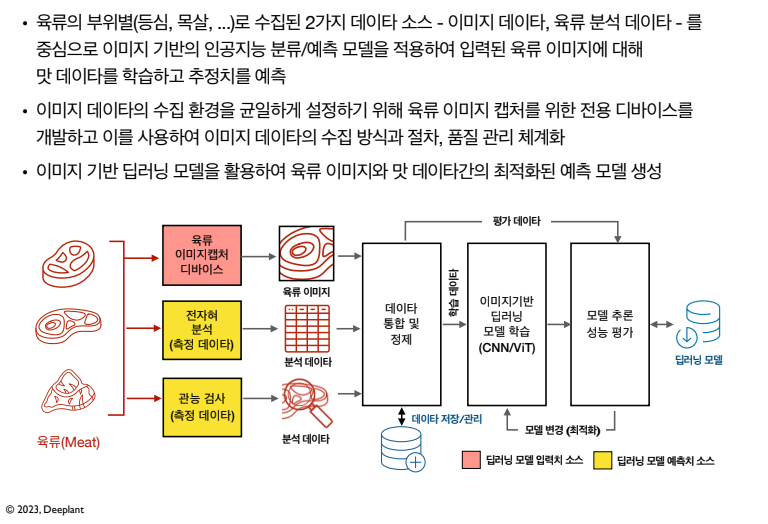

# Deeplant
딥러닝기반 육류 맛 선호 예측 시스템 개발 프로젝트.
### 프로젝트 목표
육류에 대한 고객/구매자의 '맛에 대한 선호도(tasty preference)' 데이타를 육류 이미지와 분석된 미각
데이타로 나누어 체계적으로 수집하고, 이를 기반으로 이미지 기반의 육류에 관한 상세한 맛 데이타를
자동으로 분류하고 예측하는 인공지능 예측 모델을 구축하여 향후 고객/구매자들에게 최적화된 육류
개인화 추천을 위한 시스템 개발을 목표로 합니다.
### 시스템 소개



### 맛 데이터
* 맛 데이터는 전자혀를 통해 얻어진 육류 분석 데이터와 관능검사 데이터 중에서 유효 파라미터들로 구성.
* 총 31개 항목중 "전자혀 분석"의 맛 측정치 항목(5)과 "관능검사" 항목(12)을 합하여 총 17개를 사용


# Installation
Ensure you have a python environment, `python=3.9` is recommended.
```sh
pip install -r requirement.txt
```
(option)
```sh
pip install transformers datsets accelerate nvidia-ml-py3
```

# Quick Start ⚡
1. Clone repository
    ```sh
    git clone https://github.com/Deeplant2/Deeplant.git
    ```
2. Run model
    ```sh
    python manage.py --run 'test' --name 'test'
    ```

# 사용 모델
* ViT
* CNN
* CoAtNet

# 사용 데이터 셋
| Name | Data Type | Range |
|---|---|---|
|image src|string|
|color|float|1 ~ 5|
|marbling|float|1 ~ 5|
|texture|float|1 ~ 5|
|surface moisture|float|1 ~ 5|
|total|float|1 ~ 5|
|grade|string| 1++. 1+, 1, 2, 3|

# 결과 및 성능
## 등급 예측


## 맛 데이터 예측
### CNN
| Model | # Params | Range |
|---|---|---|
### ViT
| Name | Data Type | Range |
|---|---|---|
### CoAtNet
| Name | Data Type | Range |
|---|---|---|

# Argument
* --run (default: 'proto'): Set the run name.
* --name (default: 'proto'): Set the experiment name.
* --model_cfgs (default: 'configs/model_cfgs.json'): Set the path to the model-related configuration file.
* --mode (default: 'train', choices: 'train', 'test'): Set the mode (train or test). Currently, only 'train' is supported.
* --epochs (default: 10): Set the number of epochs.
* --lr or --learning_rate (default: 1e-5): Set the learning rate.
* --data_path (default: '/home/work/deeplant_data'): Set the data path.

# Reference

# License